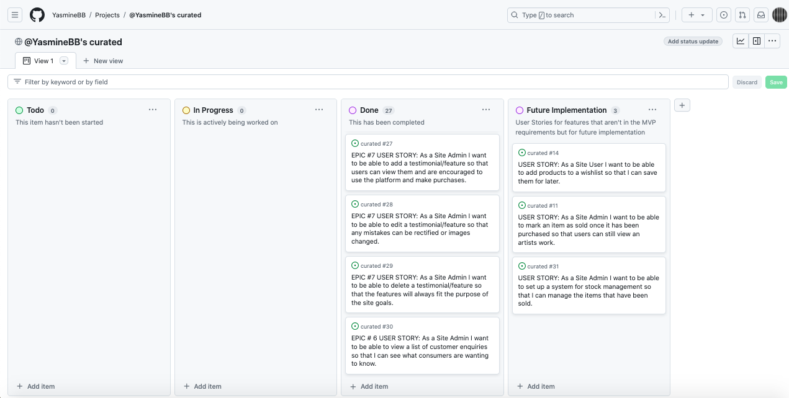
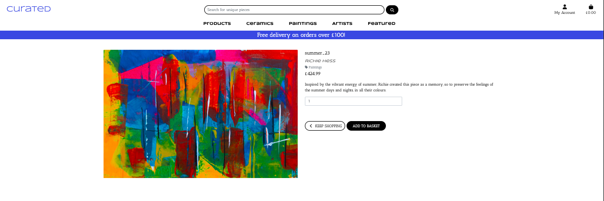

# Curated


A link to the deployed site can be found [here](https://curated-1a2337d3b0f9.herokuapp.com/)

## Table of Contents

<!-- TOC -->

- [Curated](#curated)
  - [Table of Contents](#table-of-contents)
  - [Introduction](#introduction)
  - [Business Model](#business-model)
    - [SEO and Web Marketing](#seo-and-web-marketing)
      - [SEO](#seo)
      - [Web Marketing](#web-marketing)
      - [Email Marketing](#email-marketing)
  - [User Experience](#user-experience)
    - [Strategy Plane](#strategy-plane)
      - [Project Goals](#project-goals)
    - [Scope Plane](#scope-plane)
      - [Feature Planning](#feature-planning)
    - [Structure Plane](#structure-plane)
      - [Current User Stories](#current-user-stories)
        - [EPIC - User Registration and Profile](#epic---user-registration-and-profile)
        - [EPIC - Product Viewing and Navigation](#epic---product-viewing-and-navigation)
        - [EPIC - Shopping Basket](#epic---shopping-basket)
        - [EPIC - Purchasing](#epic---purchasing)
        - [EPIC - Artist Profile](#epic---artist-profile)
        - [EPIC - Features/Testimonials](#epic---featurestestimonials)
        - [EPIC - Contact](#epic---contact)
      - [User Stories for Future Implementation](#user-stories-for-future-implementation)
      - [Database Schema](#database-schema)
    - [Skeleton Plane](#skeleton-plane)
      - [Wireframes](#wireframes)
    - [Surface Plane](#surface-plane)
      - [Colour Scheme](#colour-scheme)
      - [Font](#font)
  - [Agile Development](#agile-development)
  - [Features](#features)
    - [Current Features](#current-features)
      - [Homepage](#homepage)
      - [Navigation](#navigation)
      - [Home](#home)
      - [Products Page](#products-page)
      - [Product Detail Page](#product-detail-page)
      - [Shopping Basket Page](#shopping-basket-page)
      - [Checkout Page](#checkout-page)
      - [Checkout Success page](#checkout-success-page)
      - [Artists Page](#artists-page)
      - [Artist Detail Page](#artist-detail-page)
      - [Custom Error Pages](#custom-error-pages)
      - [Defensive Programming](#defensive-programming)
      - [Toasts](#toasts)
    - [Future Features](#future-features)
    - [Accessibility](#accessibility)
  - [Issues \& Bugs](#issues--bugs)
    - [Sign Up](#sign-up)
    - [Stripe](#stripe)
    - [Crispy Forms](#crispy-forms)
  - [Technologies Used](#technologies-used)
    - [Languages Used](#languages-used)
    - [Database Used](#database-used)
    - [Frameworks \& Libraries Used](#frameworks--libraries-used)
      - [Frameworks](#frameworks)
      - [Libraries \& Packages](#libraries--packages)
      - [Programs](#programs)
    - [Stripe](#stripe-1)
  - [Testing](#testing)
  - [Deployment](#deployment)
    - [Forking the Repository](#forking-the-repository)
    - [Cloning the Repository](#cloning-the-repository)
  - [Credits](#credits)
    - [Code](#code)
    - [Content](#content)
    - [Media](#media)
      - [Homepage Image](#homepage-image)
      - [Artist Images](#artist-images)
      - [Product Images](#product-images)
    - [Acknowledgements](#acknowledgements)

<!-- /TOC -->

## Introduction

Curated is a full stack e-commerce website built using HTML, CSS, JavaScript, Python and Django and uses Stripe as the payment processor.

This project was created for my fifth and final project for my Diploma in Full Stack Software Development with Code Institute.

## Business Model

Curated, a B2C e-commerce site that takes single payments, platforms the artists as well as the art, giving potential buyers the opportunity to explore and understand the artist and their work. This will help to build more of a connection between the artist and the user, or potential buyer, which will help to encourage more purchases on the site.

The site is designed in a way that the user can navigate easily and smoothly across the site.

Having an online platform of a curated selection of art pieces extends the reach of one art gallery, and the opportunities from online traffic can be endless. A physical gallery or store is limited to the footfall rate of that area whereas online, people from all around the world are potential customers at all times.

As a B2C company, it is vital to reach out and elicit an emotional response from customers, and build a relationship. The web marketing methodologies are huge in doing so, and social media presence is an important factor in building and maintaining this connection.

Without the costs that come with a physical location, such as a gallery or space that sells art, there is more space for higher margins for both curated, as well as the artist.

With the popularity of smartphones and people being able to browse and shop on the go, it’s important that curated capitalises on this opportunity, especially as B2C customers are more likely to make impulse purchases. Curated is a mobile first app that makes it east for customers to browse unique art pieces at home, work or on the go.

As an online intermediary, curated uses its platform to bring artists and customers together.

The artists will rely on curated to platform their work and attract sales, and web marketing will play a huge role in making this happen.

Having an authentication system and allowing the customer to be able to save their shipping information also makes it easier and faster for future payments to be made.

### SEO and Web Marketing

#### SEO

Implementing Search Engine Optimisation practices is important because it helps improve the ranking of a website in search engine listings. This is highly important especially for an online business. On top of this, it's important to make the site as accessible as possible for screen readers.

Some example implemented in this project include:

- Descriptive meta tags including description, keywords as well as a title tag were added in the base.html file, extending across all pages. 
  - Meta tags are important for SEO as they help search engines understand what the web pages are about and how it appears in search results. They are also important in terms of accessibility, being used by screen readers to describe the web pages to users.
- There is meaningful alt text used on main images on the site, for example the product images have the product description as their alt text and the artist images have the artist bio as their alt text.
- Clear and concise headings are used.

- There is a sitemap.xml that lists the sites essential pages and allows search engines to crawl them.
- There is a robots. txt file that restricts crawlers from accessing certain pages.

#### Web Marketing

A mock-up of a Facebook business page was made from the template provided by Code Institute, as well as a mock-up of an Instagram business page. These are important in helping the business to reach a wider audience, and would be used beyond the purpose of this project.

- Facebook Page


- Instagram Page


Implementation of web marketing strategies for Curated include building community in the form of features of art pieces bought by customers in their new homes. Customers are invited to share photos of their pieces, and to tag Curated, on social media. They are encouraged to get in touch if they want to be featured on the site.

Future implementations and expansions on this include the potential for artists whose work is platformed on the site, to be featured and to show a preview into their process, or a behind the scenes look in the form of short videos or a Q&A like format. This would attract and engage potential customers by bringing them into the artists world, invoking an emotional response and forming the start of a relationship that would hopefully turn into sales which would benefit both the artist and Curated.

This would also improve the chances of other potential artists wanting to be involved in being platformed on the site.

These strategies would be tied closely with organic social media marketing, with content being used across several platforms, as well as email marketing which would complement each other nicely.

#### Email Marketing

In the footer of the site, users can subscribe to receive a newsletter from curated, using [Mailchimp](https://mailchimp.com/). This functionality works in user sign up and in future implementations, a newsletter campaign will be implemented.

## User Experience

### Strategy Plane

#### Project Goals

Curated is a Business to Consumer e-commerce site (B2C). It's target audience are people who want to browse and buy unique, one off art pieces by independent artists to display in their homes.

They will be people who enjoy and appreciate art, the work that goes into the pieces and the story behind them.

According to [Artsy](https://www.artsy.net/article/artsy-editorial-drives-art-buyers), the top two reasons for buying unique art pieces were *“to decorate their homes and to provide a source of inspiration in their daily lives.”*

In interviews, *“collectors indicated that a work’s aesthetic appeal is frequently the gateway to a deeper exploration of the artist and their career.”*

### Scope Plane

#### Feature Planning

I created the following table of opportunities for the project to determine the trade-off of importance versus viability of my user stories rated low (1) to high (5). Features that score highly on importance and viability are to be addressed first in achieving the MVP, followed by features who score in the mid and low range which can be added in future versions.

| **User Type** | **Feature** | **Importance** | **Viability** | **MVP** | **Delivered** |
| ---------| ----------- | -------------- | ------------- | ------- | ------------- |
| User | Register for an account | 5 | 5 | MVP | ✅ |
| User | Log In | 5 | 5 | MVP | ✅ |
| User | Password recovery | 5 | 5 | MVP | ✅ |
| User/Guest | Social media sign up | 2 | 4 ||
| User | Save/update personal & billing details | 5 | 5 | MVP | ✅ |
| | | | | |
| User | View products | 5 | 5 | MVP | ✅ |
| User | Add items to basket | 5 | 5 | MVP | ✅ |
| User | Edit basket | 5 | 5 | MVP | ✅ |
| User | Make a purchase | 5 | 5 | MVP | ✅ |
|User | Email confirmation of purchase | 5 | 5 | MVP | ✅ |
| User | Order History | 4 | 5 | MVP | ✅ |
| User | Wishlist | 2 | 3 ||
| | | | | |
| User | View artist profiles | 5 | 5 | MVP | ✅ |
| User | Add artist to favourites | 2 | 4 ||
| User | Alerted to favourited artist new product | 2 | 4 ||
| | | | | |
| User | Contact Form | 5 | 5 | MVP | ✅ |
| User | Subscribe to newsletter | 5 | 5 | MVP | ✅ |
| User | View Privacy Policy | 5 | 5 | MVP | ✅ |
| User | Error pages (404/500) | 5 | 5 | MVP | ✅ |
| User | Receives message alerts (toasts) | 5 | 5 | MVP | ✅ |
| | | | | |
| Admin | Add new product | 5 | 5 | MVP | ✅ |
| Admin | Update/edit product | 5 | 5 | MVP | ✅ |
| Admin | Delete product | 5 | 5 | MVP | ✅ |
| | | | | |
| Admin | Add new artist | 5 | 5 | MVP | ✅ |
| Admin | Update/edit artist profile | 5 | 5 | MVP | ✅ |
| Admin | Delete artist profile | 5 | 5 | MVP | ✅ |
| | | | | |
| Admin | Add feature/testimonial | 5 | 5 | MVP | ✅ |
| Admin | Update/edit a feature/testimonial | 4 | 5 |
| Admin | Delete a feature/testimonial | 4 | 5 |
| Admin | View list of customer enquiries | 4 | 5 |

### Structure Plane

#### Current User Stories

I created user stories in a Google sheets document in my planning stage which helped me to organise tasks. Each user story had an issue created, and this documentation can be found in my projects board and is explained in the [Agile Development](#Agile-Development) section.

I have created user stories for all users of the site which are:

- Site User
- Site Admin

##### EPIC - User Registration and Profile

As a Site User:

- I want to be able to register for an account so that I can have an account and a profile on the site.
- I want to be able to log in and out so that I can keep my information secure.
- I want to be able to reset my password so that I can recover and access my account if I forget the password.
- I can view my profile so that I can save my shipping details and see my order history.

##### EPIC - Product Viewing and Navigation

As a Site User:

- I want to be able to view the details of a product so that I can decide whether I want to make a purchase
- I want to be able to search keywords so that I can quickly find what I am looking for.
- I want to be able to sort and filter my search so that I can quickly find what I am looking for
- I want to be able to easily navigate from one page to another so that I can have a pleasant shopping experience.
- I want to be able to easily view unique pieces so that I can decide whether I want to add to my basket.

As a Site Admin:

- I want to be able to add products to the site so that users are able to browse and buy.
- I want to be able to make updates to products on the site so that any changes are reflected on the site.
- I want to be able to delete products on the site so that any changes are reflected on the site.

##### EPIC - Shopping Basket

As a Site User:

- I want to be able to view my basket so that I can review the contents before purchasing.
- I want to be able to add items to my basket so that I can make a purchase.
- I want to be able to delete items from my basket so that I can decide on my final purchase.

##### EPIC - Purchasing

As a Site User:

- I want to be able to make a purchase on the site so that I can buy and enjoy the items I had in my basket.
- I want to receive an email confirmation so that I can make sure my purchase was successful.

##### EPIC - Artist Profile

As a Site User:

- I want to be able to view a profile of an artist so that can find out more about the artist whose work I am interested in and make a more informed decision on purchasing.

As a Site Admin:

- I want to be able to add artists to the database so that users can find out more about the artists whose pieces they are interested in.
- I want to be able to edit artist profiles on the database so that artists can have their most up-to-date information on the site.
- I want to be able to delete artists from the database so that only the artists whose work is listed appears on the site.

##### EPIC - Features/Testimonials

As a Site User:

- I want to be able to view features/testimonials showing other customers purchases in their homes so that I can make an informed decision on using the site and purchasing.

As a Site Admin:

- I want to be able to add a feature/testimonial so that users can view them and are encouraged to use the platform and make purchases.
- I want to be able to edit a feature/testimonial so that any mistakes can be rectified or images changed.
- I want to be able to delete a feature/testimonial in case it no longer fits the purpose of the site goals.

##### EPIC - Contact

As a Site User:

- I want to be able to submit a contact form so that I can communicate with curated.

As a Site Admin:

- I want to be able to view a list of customer enquiries so that I can see what consumers are wanting to know.

#### User Stories for Future Implementation

- As a Site User I want to be able to add products to a wishlist so that I can save them for later.
- As a Site Admin I want to be able to mark an item as sold once it has been purchased so that users can still view an artists work.
- As a Site Admin I want to be able to set up a system for stock management so that I can manage the items that have been sold.

#### Database Schema

An Entity Relational Diagram was created for this project and shows the relationship between the models/databases.


There are eight models in this project:

- User
- UserProfile
- Order
- Product
- Category
- Artist
- ContactForm
- Testimonial

### Skeleton Plane

#### Wireframes

[Wireframes](./wireframes.md) for this project were created in Balsamiq.

### Surface Plane

#### Colour Scheme

There is an overall muted colour scheme for the site with a bold blue feature colour and a complementary mustard yellow. The reason for this is so that the artworks are the main focus for the user, and the site provides a clean base for the works. The site header of the site is a bold blue, and most of the text on the site is in black, to contrast against the white background. Some headings are in blue, some in mustard yellow. When an item in the navigation bar is hovered over, it's highlighted in mustard yellow to make it clear to users the page they will be selecting.

Below is the initial colour scheme which was created in [Coolers](https://coolors.co/000000-2a5ddf-d39822-ffffff).


During testing, and wanting to ensure the site is accessible, another shade of yellow was added. This is explained in the [Testing](./testing.md) file.

So the final colour scheme looks like this. The change is barely visible, but I wanted to make sure the site was as accessible as possible whilst also maintaining the overall style and feel of the site.


#### Font

I used [Font Joy](https://fontjoy.com/) to generate font pairings so that I could see the font choices together and if they worked well. I sourced the fonts from [Google Fonts](https://fonts.google.com/selection).

## Agile Development

I used agile development methodology to help me plan and manage my time more effectively and to ensure that I delivered the tasks I needed to in each sprint. This was the second time applying it, my previous fourth project being the first, and I feel as though I utilised it in a much more effective way.

I used GitHub projects to build the kanban board. I created issues for the user stories and each issue was given a Milestone and Labels to help.

This is my projects board around the start of my project:


This is my projects board around midway through my project:


This is my projects board at the end of the project:



I had 7 Epics, and split the user stories across these epics.

- User Registration and Profile
- Product Viewing and Navigation
- Shopping Basket
- Purchasing
- Artist Profile
- Testimonials/Features
- Contact

I used the MoSCoW method for prioritisation, using the following labels:

- must-have
- should-have
- could-have
- wont-have
- future-implementation

The project was divided into four sprints, each sprint having a two-week timeframe. These sprints were under the Milestones heading.

Here is an example of the use of labelling and milestones on one of my issues:


## Features

### Current Features

#### Homepage


The homepage has a 

#### Navigation

The navigation bar contains the site's header, curated, which redirects the user back to the homepage from any page on the site. Navigation links include:

- A dropdown link on Products where users can view all products, products by price, category or artist.
- Ceramics - which takes the user to a page that displays all the pieces in the category Ceramics.
- Paintings - which takes the user to a page that displays all the pieces in the category Paintings.
- Artists - which takes the user to the page that displays all artists.
- Featured - which takes the user to the page that features artists work in the homes of their consumers.

It also includes a search bar where users can search for terms that are included in the product name, category, description as well as the artist name.

There is a My Profile link where users can either register, log in, log out. If the user is a superuser or admin, there are links to:

- Product Management
- Artist Management
- Feature Management

There is also a shopping cart icon that displays the value of the contents if the user has added any items or 0 if empty. If the basket contains any items it is highlighted to
reflect this to the user.

Below that are navigation links to the products, categories and artists.

Under Products, the user can select to sort by:

- Price
- Category
- Artist

Or they can select to view All Products.

Under the Ceramics and Paintings options, the user can select to view all from those two categories.

Under the Artists option, the user can select to view all artists.

#### Home


The homepage has a background image of ceramic vases, representing what users might see on the site, with a call to action to View All Products.

#### Products Page


The Products page displays all the pieces that are available to purchase. They are listed with the following:

- Product Image
- Name
- Category tag (e.g. ceramics or paintings)
- Artists Name
- Price
- Product Description

#### Product Detail Page



Once a product is selected, the user is taken to the product detail page which lists all the same information, as well as the option of adding the item to the basket. As the pieces are one off, there is only one quantity of each item. If a user already has the product in their basket, and they try to add it again, they receive a message alert stating 'there is only one of these, and you have it in your basket. They are also unable to adjust the quantity box.

#### Shopping Basket Page


In the shopping basket page, the user is presented with all the items in their basket. Here, they are able to delete any items if they wish, and are able to then proceed to checkout, or continue shopping.

#### Checkout Page


In the checkout page the user can enter their details and card information and from here they can either click to Adjust Bag or Complete Order.

#### Checkout Success page


#### Artists Page


The Artist's page displays a selection of all the artists who have their work listed on the site. The artist is represented by their photo and name, and when hovered over, the user can see a preview of the artists' bio with a link to read more.

#### Artist Detail Page

When a user selects an artist, they are taken to the artist detail page which gives the full set of information, including the artists social media links, if they have them.

The links to socials only take the user to each sites' homepage for the purpose of this project, but if this site was developed in the future, of course this would be accurate.

#### Custom Error Pages

There are custom error pages for HTTP 404 Not Found and HTTP Error 500.

Here is the message received when coming across a page not found error.


#### Defensive Programming

Defensive programming has been used across the site to prevent non-authorised users from accessing certain pages and features. For admin related features, functionalities to check if a user is a superuser have been implemented. If a non admin user tries to access pages they are unauthorised to, they receive an error toast alert which feedback to the user that they aren't authorised to access those pages.


#### Toasts

Messaging is used for a number of tasks across the site using toasts. For example:

- Logging in and out
- Adding an item to the basket
- Making a purchase
- Admin tasks such as adding an item or artist to the database.

This is important as there is constant feedback for the user which adds to a pleasant experience without confusion.


### Future Features

Future features to implement in this site include:

- Adding a wishlist that users can add items to.
- Stock management system to manage the stock when items are sold.
- Sending newsletters to users who subscribe.
- Implement social account login.

### Accessibility

To ensure the site is as accessible as possible to all users, I have made sure to use descriptive alt attributes on images and made sure that there is sufficient colour contrast across the site. More information on this regarding testing in Google Lighthouse can be found in [Testing](./testing.md).


## Issues & Bugs

### Sign Up

I had an issue when testing user sign up on the site. After entering all the information and clicking the Sign-Up button, the page was stuck on loading and wouldn't take the user to the intended next step, which was sending the confirmation link and displaying the page explaining so. The user was, however, added to the database, after checking in the Django admin. When signing up using the same information, assuming it hadn't been successful, the user was alerted that a user with that information already existed in the database. After spending time troubleshooting, I contacted tutor Support who assisted me and discovered the fix was that Heroku wasn't using the correct version of Python, and the fix was to create a runtime.txt file and that solved the issue.

### Stripe

I had a few issues with Stripe, including webhooks not sending as well as when a user completed the checkout process, they were taken to the confirmation page and received a confirmation email, however no grand total was displayed. The total was showing after placing an order in development but not in production. After consulting tutor support and spending hours troubleshooting, checking secret keys which all matched up. In the end I deleted the endpoint, created a new one and then updated the STRIPE_WH_SECRET in the Heroku config vars, and this seemed to solve the problem.

### Crispy Forms

All the form on the site were applying the crispy form filter accurately except the checkout page which kept throwing a BoundField error. In the end the form was styled with CSS targeting each field.

## Technologies Used

### Languages Used

Languages used in this project include:

- HTML
- CSS
- JavaScript
- Python

### Database Used

- sqlite3 was used for development.
- ElephantSQL was used for deployment.

### Frameworks & Libraries Used

#### Frameworks

- Django - Python framework that encourages rapid development and clean, pragmatic design.
- Bootstrap4 - CSS framework used to develop a responsive and mobile-first site.

#### Libraries & Packages

- Font Awesome - Used for the icons used across the site.
- Google Developer Tools - Used for testing for example responsiveness and troubleshooting.
- jQuery - JavaScript library to simplify tasks and event handling.
- pillow - Python library to deal with images.
- gunicorn - Python WSGI server.
- boto3- Used to integrate Python with AWS S3 bucket.
- Django Allauth - Used for accounts, authentication and registration.
- django-countries - Used to provide country choices in forms on the site.
- django-crispy-forms - Used to render forms on the site.
django-storages - Used for storage backends.
- psycopg2 - Used to allow connection with a postgres database.

#### Programs

- [Favicon](https://favicon.io/favicon-generator/) - Used to create the favicon.
- [Balsamiq](https://balsamiq.com/) - Used to create the wireframes.
- [DrawSQL](https://drawsql.app/) - Used to create the database schema.
- [Tiny PNG](https://tinypng.com/) - Used to compress the images uploaded to the site.

### Stripe

Stripe has been used to implement the payment processing system in the project.

When testing payments I have used the testing cards that Stripe has listed on its website.

| **Payment Type** | **Card Number** | **Expiry** | **CVC** | **ZIP** |
| ---------| ----------- | -------------- | ------------- | ------------- |
| Payment success | 4242 4242 4242 4242 | any future date | any 3 digits| any 5 digits |
| Payment fail | 4000 0000 0000 0069 | any future date | any 3 digits | any 5 digits |

## Testing

All testing carried out can be found [here](./testing.md).

## Deployment

Full steps taken to deploy the site can be found [here](./deployment.md).

### Forking the Repository

In order to fork the project, the following steps are to be followed:

1. Log in to GitHub.
2. Navigate to the repository.
3. Find the 'Fork' button to the top right of the page.
4. Once you click this button the fork will be in your repositories.

### Cloning the Repository

In order to run this project locally, the following steps are to be followed:

1. Install the Gitpod Browser Extension for Chrome.
2. After installation, restart the browser.
3. Log into GitHub or create an account.
4. Locate the GitHub Repository.
5. Click the green 'Gitpod' button in the top right corner of the repository. This will trigger a new Gitpod workspace to be created from the code in GitHub where you can work locally.

How to run this project within a local IDE, such as VSCode:

1. Log into GitHub or create an account.
2. Locate the GitHub Repository.
3. Under the repository name, click "Clone or download".
4. In the Clone with HTTPs section, copy the clone URL for the repository.
5. In your local IDE open the terminal.
6. Change the current working directory to the location where you want the cloned directory to be made.
7. Type 'git clone', and then paste the URL you copied in Step 3.
```git clone https://github.com/USERNAME/REPOSITORY```
8. Press Enter. Your local clone will be created.

Further reading and troubleshooting on cloning a repository from GitHub here

## Credits

### Code

I followed along with the Code Institute walkthrough project, Boutique Ado, which has been greatly helpful, and a lot of the code in this project has been used and adapted from that.

### Content

Most of the content on the site has been written by myself with some content for a few of the artist profiles were used and adapted from [Print Club London](https://printclublondon.com/).

### Media

All product and artist images used on the site were taken from:

- [Freepik](https://www.freepik.com/)
- [Unsplash](https://unsplash.com/)

#### Homepage Image

- [Homepage](https://unsplash.com/photos/brown-clay-vase-on-white-wooden-shelf-O4sAutEMPNM)

#### Artist Images

- [Artist-1](https://unsplash.com/photos/woman-in-gray-long-sleeve-shirt-writing-on-white-paper-o15lOC7SJKs)
- [Artist-2](https://unsplash.com/photos/man-in-white-crew-neck-shirt-7v70tbUD7GE)
- [Artist-3](https://unsplash.com/photos/a-woman-is-making-a-vase-out-of-clay-KedwQjtLCYU)
- [Artist-4](https://unsplash.com/photos/cph_MChcDWY)

#### Product Images

- [Painting-1](https://unsplash.com/photos/a-painting-on-a-wall-with-a-lot-of-paint-splattered-on-it-7vxAgEu4JlU)
- [Painting-2](https://unsplash.com/photos/QbTwalepFn0)
- [Painting-3](https://unsplash.com/photos/yellow-blue-and-green-abstract-painting-D2dwVE-sGjU)
- [Painting-4](https://unsplash.com/photos/multicolored-abstract-painting--zASKXkwkIY)
- [Painting-5](https://unsplash.com/photos/multicolored-graffiti-yFy7sS3pVZk)
- [Ceramics-1](https://unsplash.com/photos/white-and-brown-ceramic-vase-aS5bxWhR7J0)
- [Ceramics-2](https://www.freepik.com/free-ai-image/elegant-modern-vase-design_47992970.htm#query=largevase&position=8&from_view=search&track=ais_ai_generated&uuid=56c5256d-d10d-4c5c-8604-e9c6e1b0cb9b)
- [Ceramics-3](https://www.freepik.com/free-ai-image/elegant-modern-vase-design_47992953.htm#query=largevase&position=17&from_view=search&track=ais_ai_generated&uuid=797759c2-3a8d-4227-8e83-70e82a0fef7f)
- [Ceramics-4](https://unsplash.com/photos/green-and-brown-plant-in-clear-glass-vase-HGzqLrytONM)

### Acknowledgements

I would like to give a huge thanks to my Code Institute mentor Richard Wells who has been a huge great support during this project! I would also like to thank the Code Institute tutors who have assisted me in solving problems and bugs along the way.
