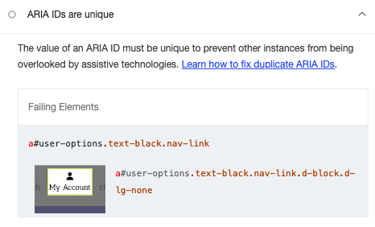

# Google Lighthouse Testing

As part of the testing of the site, all pages were run through Google Lighthouse.

## Issues and Fixes

After running Google Lighthouse testing on all pages on the site, some main issues were as follows:

- Performance - low scores
  - A lot of the issues that were presented with performance scoring came down to issues that I couldn't fix here, for example 'Site uses third party cookies'. These are from Mailchimp and Stripe which I have no control over.

- Accessibility - low scores
  - Some pages on the site have headings in the colour #D39822, which is one of the main colours in the sites colour scheme and contributes to the overall style of the site. After checking the contrast checker on WEBAIM to see if slightly darker shade would make it more accessible and finding the shade #BA881C shade passed WCAG AA with large text. As this colour is applied headings, the colour was changed and this increased the accessibility score.
  

### FIX - Best Practices: Links do not have descriptive text

One issue that came up regarding the lack of descriptive text in the footer link to the About page. There is a preview of the about page content with a link to the About page with the text 'Read More'. I have changed this link to 'Read more about us' to be more in line with best practices.

### FIX - Accessibility: ARIA IDs are unique

I updated the aria label of the dropdown menu for admin authenticated users to 'admin-user-options' to avoid a clash with the id in the My Account link.

Here are the results of testing all the pages on the site with Google Lighthouse in both Mobile and Desktop after the fixes.

## Mobile

### Homepage

### Products Page

### Product Detail Page

### Shopping Basket Page

### Checkout Page

### Checkout Success Page

### Add a Product to the Database Page

### Edit Product Page

### Artists Page

### Artist Detail Page

### Add Artist to the Database Page

### Edit Artist Profile Page

### Contact Page

### Contact Success Page

### About Page

### Privacy Policy

## Desktop

### Homepage

### Products Page

### Product Detail Page

### Shopping Basket Page

### Checkout Page

### Checkout Success Page

### Add a Product to the Database Page

### Edit Product Page

### Artists Page

### Artist Detail Page

### Add Artist to the Database Page

### Edit Artist Profile Page

### Contact Page

### Contact Success Page

### About Page

### Privacy Policy

