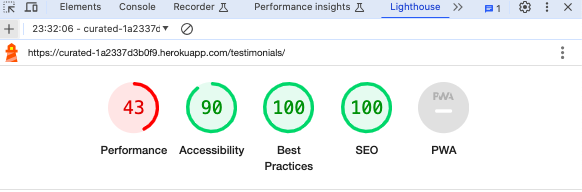

# Google Lighthouse Testing

As part of the testing of the site, all pages were run through Google Lighthouse. Overall, the Accessibility and SEO scored were high, but there were some issues with performance scores.

## Issues and Fixes

After running Google Lighthouse testing on all pages on the site, some main issues were as follows:

- Performance - low scores
  - A lot of the issues that were presented with performance scoring came down to issues that I couldn't fix here, for example 'Site uses third party cookies' and 'Render blocking resources. These are from Mailchimp, AWS and Stripe, for example, which I can't do much about.
  - I compressed all images on the site as well as converted them to wepb.
  - The performance scores are still very low and after some searching online, it could be that the server is causing this issue, as they would also vary each time I tested on the same page without changing anything.
  - At the time of testing I was not able to use another device that had Google Chrome installed to be able to check this but plan to do so in the future.

- Accessibility - low scores
  - Some pages on the site have headings in the colour #D39822, which is one of the main colours in the sites colour scheme and contributes to the overall style of the site. After checking the contrast checker on WEBAIM to see if slightly darker shade would make it more accessible and finding the shade #BA881C shade passed WCAG AA with large text. As this colour is applied headings, the colour was changed and this increased the accessibility score.

  

### FIX - Best Practices: Links do not have descriptive text

One issue that came up regarding the lack of descriptive text in the footer link to the About page. There is a preview of the about page content with a link to the About page with the text 'Read More'. I have changed this link to 'Read more about us' to be more in line with best practices.

Here are the results of testing all the pages on the site with Google Lighthouse in both Mobile and Desktop after the fixes.

### FIX Alt text

I added alt text to the 'Read More' link on the artist's page once their image is hovered over, as this was flagged in the Lighthouse scoring for the Artist page. However, this was removed after being flagged as an error in the HTML validator testing.

## Mobile

### Homepage

### Products Page

### Product Detail Page

### Shopping Basket Page

### Checkout Page

### Checkout Success Page

### Add a Product to the Database Page

### Edit Product Page

- Some SEO issues here are regarding the image to attach which I could not fix within the purposes of the project but will take a look at in the future.

### Artists Page

### Artist Detail Page

### Add Artist to the Database Page

### Edit Artist Profile Page

### Contact Page

### Contact Success Page

- Lighthouse only generated for the contact page.

### Features/Testimonials Page

### Add Features/Testimonial Page

### Edit Feature/Testimonial Page

### About Page

### Privacy Policy

### Log In Page

### Sign Out Page

### Sign Up Page

## Desktop

### Homepage Desktop

### Products Page Desktop

### Product Detail Page Desktop

### Shopping Basket Page Desktop

### Checkout Page Desktop

### Checkout Success Page Desktop

### Add a Product to the Database Page Desktop

### Edit Product Page Desktop

- Some SEO issues here are regarding the image to attach which I could not fix within the purposes of the project but will take a look at in the future.

### Artists Page Desktop

### Artist Detail Page Desktop

### Add Artist to the Database Page Desktop

### Edit Artist Profile Page Desktop

### Contact Page Desktop

### Contact Success Page Desktop

- Lighthouse only generated for the contact page

### Features/Testimonials Page Desktop

### Add Features/Testimonial Page Desktop

### Edit Feature/Testimonial Page Desktop

### About Page Desktop

### Privacy Policy Desktop

### Log In Page Desktop

### Sign Out Page Desktop

### Sign Up Page Desktop

