# Testing

This section will lay out all the testing I have done for this project.

## Manual Testing

### Testing User Stories

#### EPIC - User Registration and Profile

##### As a Site User I want to be able to register for an account so that I can have an account and a profile on the site

- The navigation bar which is available on all pages has an icon for 'My Account' from where the user can click 'Register' and is able to sign up.

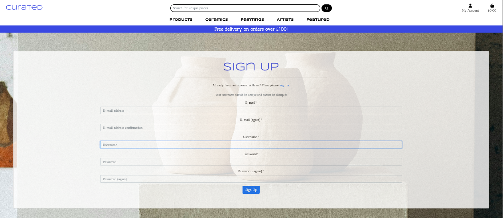

##### As a Site User I want to be able to log in and out so that I can keep my information secure

- The navigation bar which is available on all pages has an icon for 'My Account' from where the user can click 'Log In' and is able to log in.

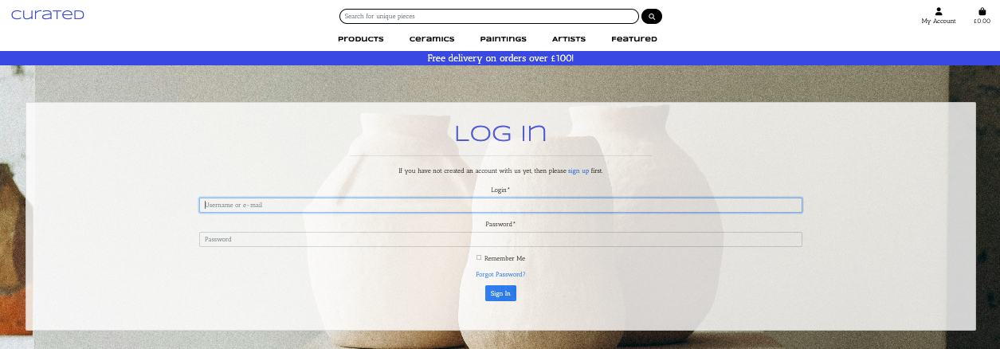

When logged in the user can click on the same icon and can click 'Log Out', is taken to a confirmation that they want to log out and can click 'Sign Out'.

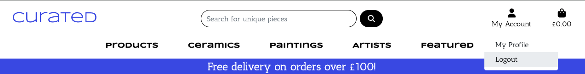

##### As a Site User I want to be able to reset my password so that I can recover and access my account if I forget the password

- If the user forgets their password, on the log in page, they can select the link to reset their password. They can enter their email address to receive a link to reset their password and follow the steps from there.

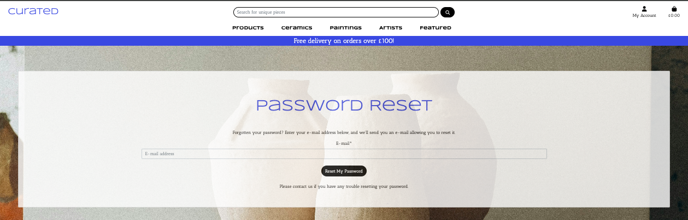

##### As a Site User I can view my profile so that I can save my shipping details and see my order history

- Once the user is logged in, they can select 'My Profile' where they will see their default delivery and order history if they have made any orders or these fields will be blank if not.

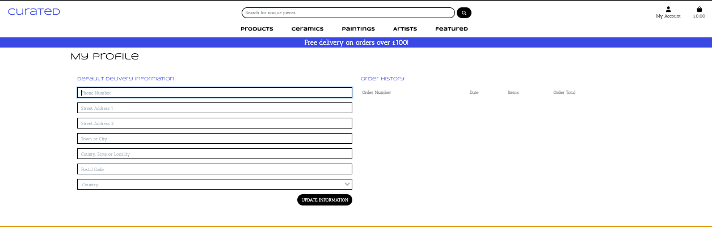

#### EPIC - Product Viewing and Navigation

##### As a Site User I want to be able to view the details of a product so that I can decide whether I want to make a purchase

When a user clicks on a product on the all products page, they are taken to a product detail page which has all the information about the product, link to the artist profile page and the option to add the product to the basket.

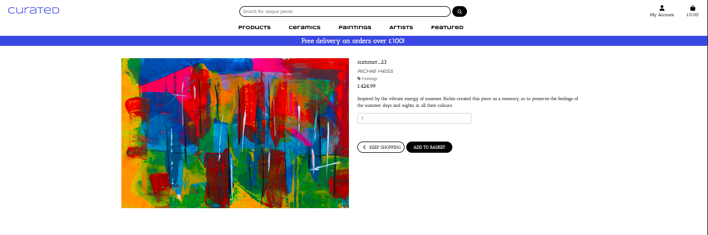

##### As a Site User I want to be able to search keywords so that I can quickly find what I am looking for

- There is a search bar where the user can search key-words that either display products that have that word in their title, description, the artists name or category.

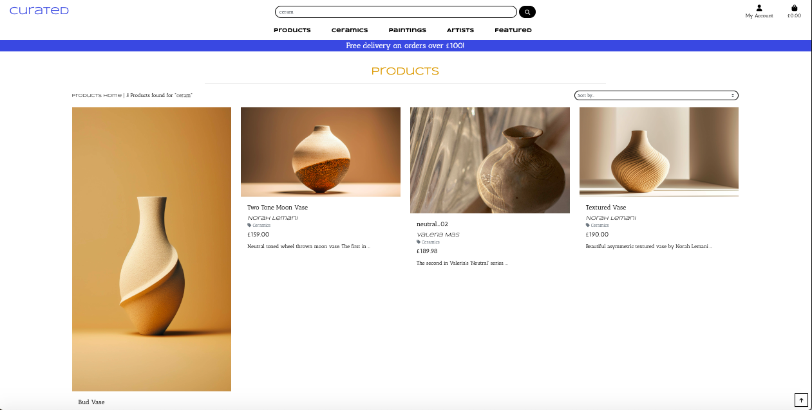

##### As a Site User I want to be able to sort and filter my search so that I can quickly find what I am looking for

- There is a sort by feature that allows the user to sort by price, artist, name or category.

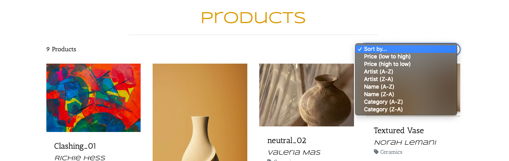

##### As a Site User I want to be able to easily navigate from one page to another so that I can have a pleasant shopping experience

- The navigation is clear and available on all pages on all devices so that the user can select what page they want to visit.

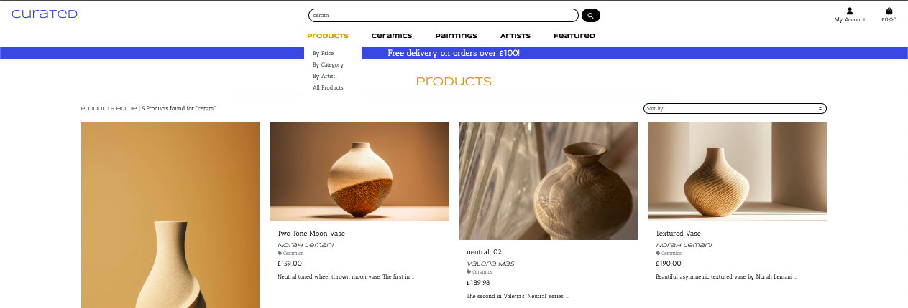

- There are buttons to go back to pages they were on, for example.

- In the footer there are also links to pages such as About, Privacy Policy and Contact.

##### As a Site User I want to be able to easily view unique pieces so that I can decide whether I want to add to my basket

- From the homepage the user can click the 'View All' button or select from the navigation bar and is taken to a page that displays all the products on the site. From there they can find out more about each product by clicking on it.

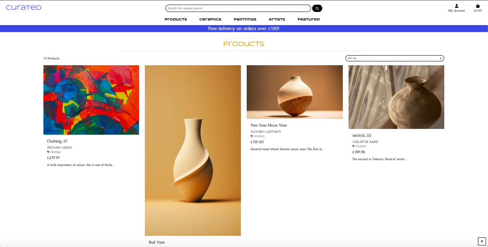

##### As a Site Admin I want to be able to add products to the site, so that users are able to browse and buy

- If user is a superuser, or admin, when logged in they have the option in the navigation bar to select 'Product Management'.

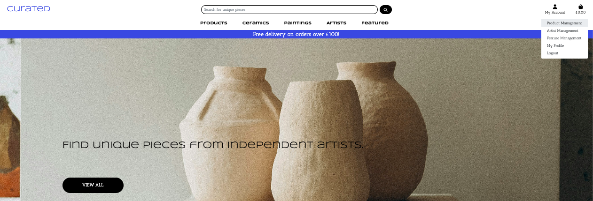

- From here they can add products to the database.

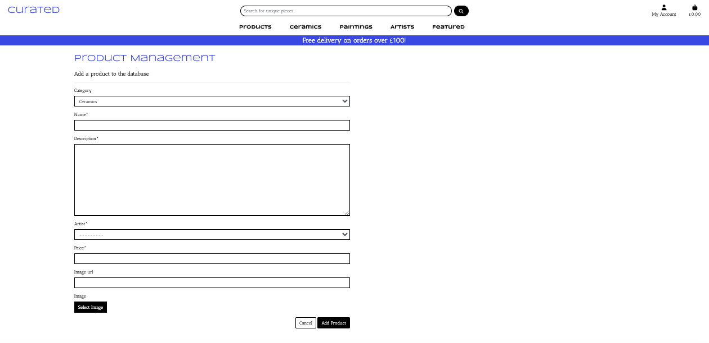

##### As a Site Admin I want to be able to make updates to products on the site so that any changes are reflected on the site

- When a superuser is logged in, in both the products and product detail pages, under each product, they have the option to edit or delete a product.

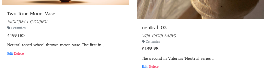

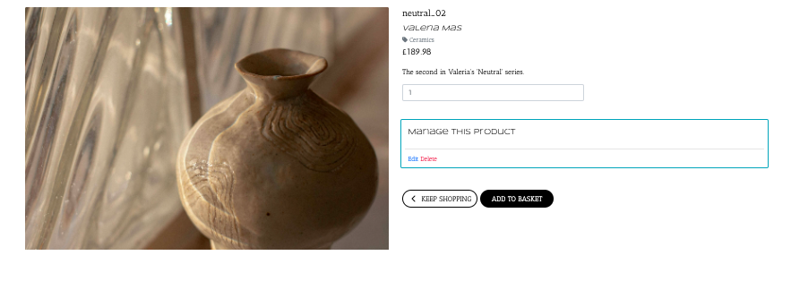

- Here they can edit and make changes to a product.

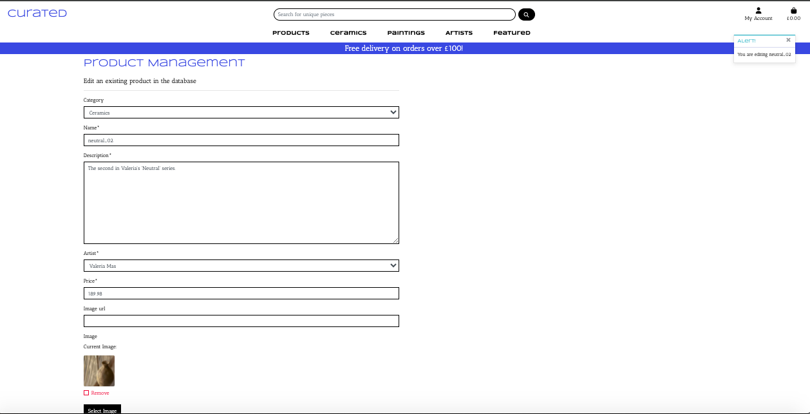

##### As a Site Admin I want to be able to delete products on the site so that any changes are reflected on the site

- Following the same steps as above, the superuser can select 'Delete' if they wish to delete a product from the database.

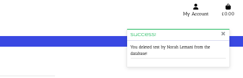

#### EPIC - Shopping Basket

##### As a Site User I want to be able to view my basket so that I can review the contents before purchasing

- The cart icon is visible on all pages so that the user can click and view their basket whenever they like.

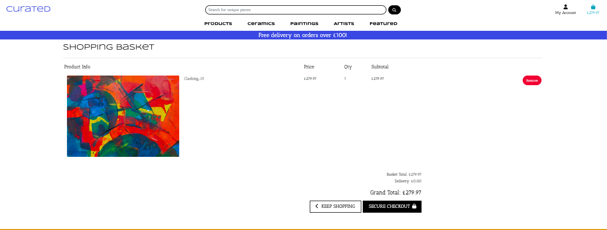

##### As a Site User I want to be able to add items to my basket so that I can make a purchase

- The user is able to add an item from the product detail page and is alerted once doing so with a message.

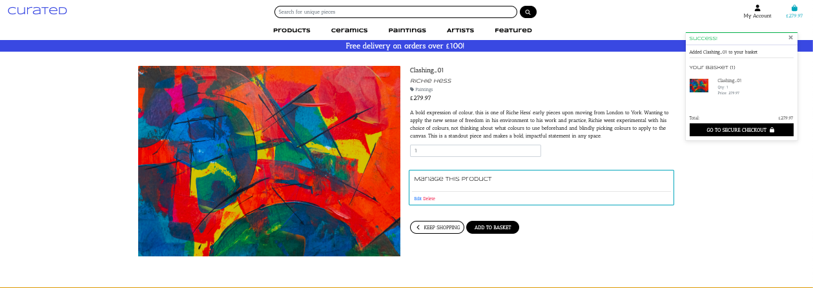

##### As a Site User I want to be able to delete items from my basket so that I can decide on my final purchase

- From their basket, the user can see a button to delete a product from their basket and receives a message upon deleting.

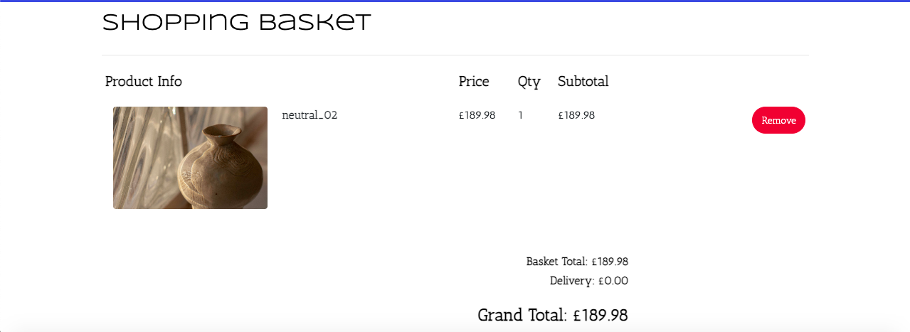

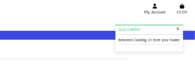

##### EPIC - Purchasing

##### As a Site User I want to be able to make a purchase on the site so that I can buy and enjoy the items I had in my basket

- The user can proceed to checkout when they have items in their basket. From here they are taken to a page to enter their details and card information.

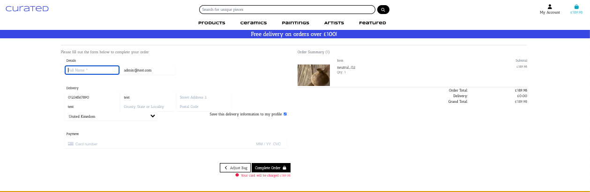

- A page confirming their order is then displayed.

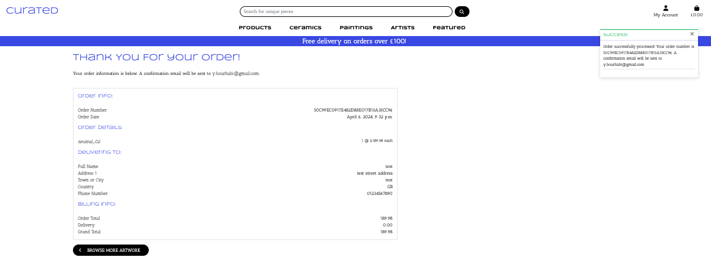

##### As a Site User I want to receive an email confirmation so that I can make sure my purchase was successful

- The user receives a confirmation email with a summary of their order.

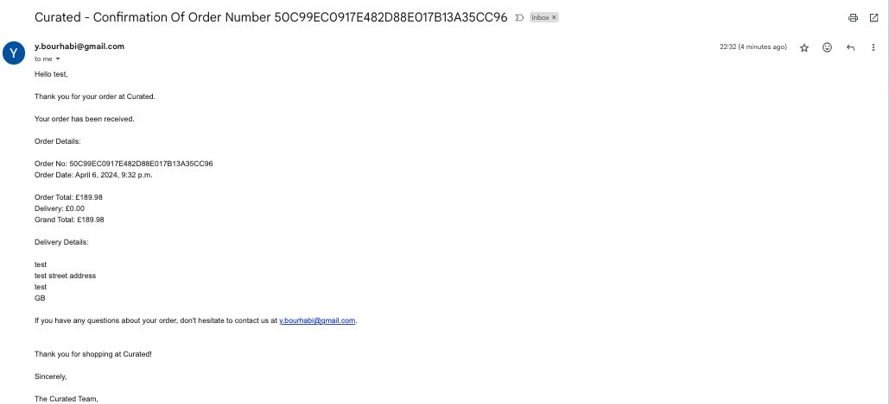

#### EPIC - Artist Profile

##### As a Site User I want to be able to view a profile of an artist so that can find out more about the artist whose work I am interested in and make a more informed decision on purchasing

- There is a link in the navigation to take the user to a page that displays all artists with work on the site. From here they can click on an artist, and it takes them to the profile of that particular artist. From the products page, the user can also click on the artists name under a product and that also directs them to the artists profile page.

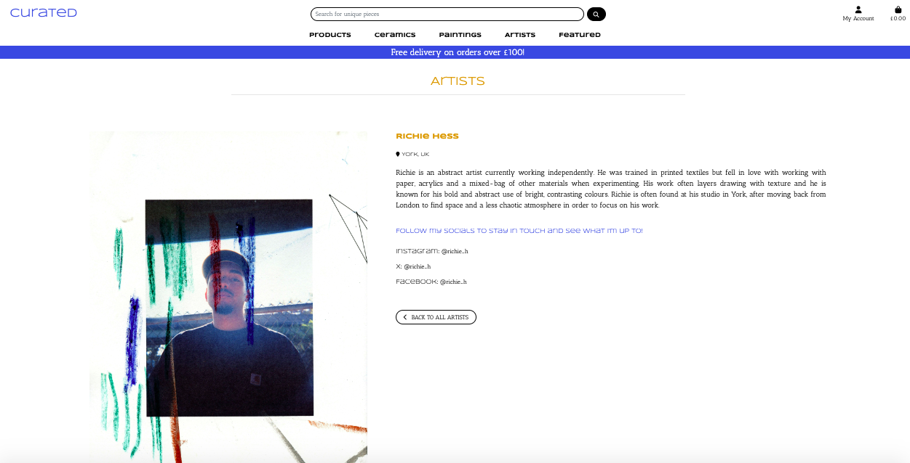

##### As a Site Admin I want to be able to add artists to the database so that users can find out more about the artists whose pieces they are interested in

- When an admin or superuser is logged in, under the My Account icon they can click Artist Management where they can add an artist to the database.

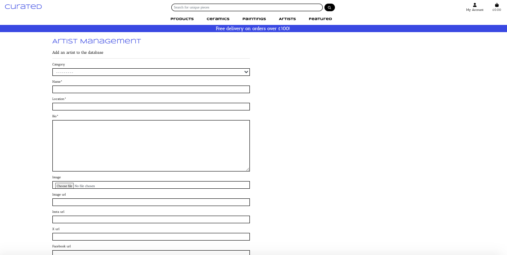

##### As a Site Admin I want to be able to edit artist profiles on the database so that artists can have their most up-to-date information on the site

- Site admin is able to click on 'Edit' under the artists profile to edit and make updates to the profile.

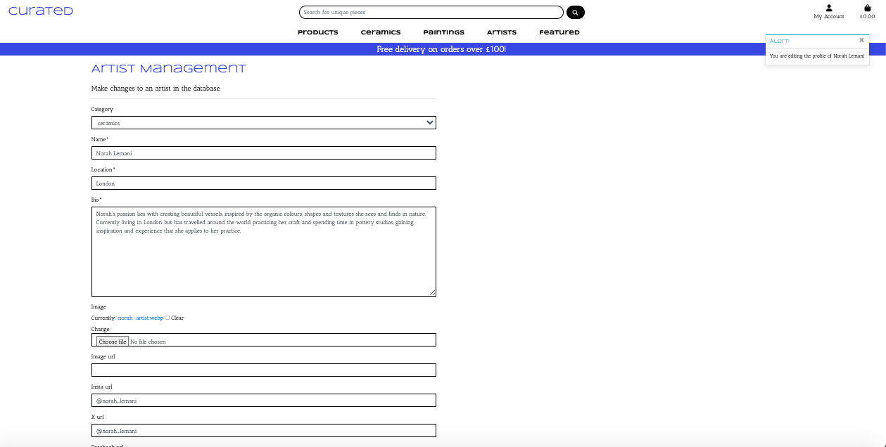

##### As a Site Admin I want to be able to delete artists from the database so that only the artists whose work is listed appears on the site

- Site admin is able to delete artists from the database from the artist detail page when logged in.

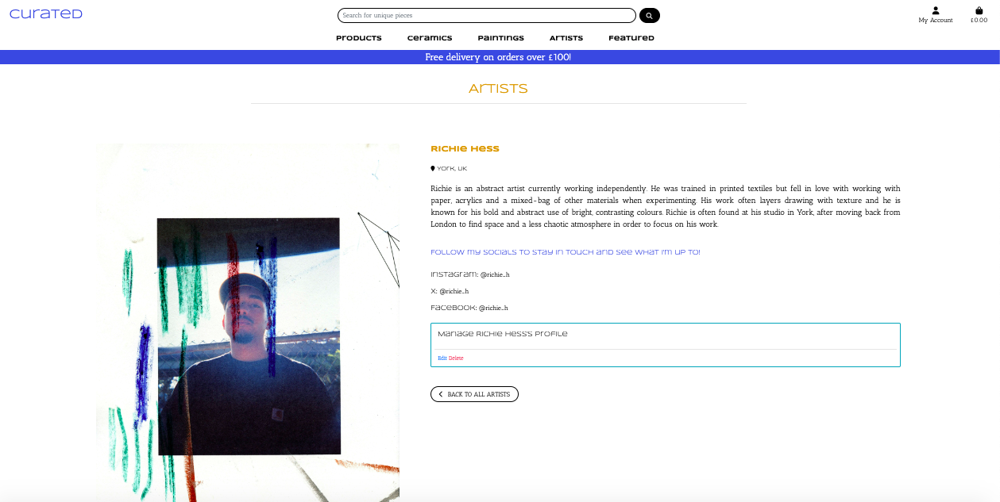

#### EPIC - Features/Testimonials

##### As a Site User I want to be able to view features/testimonials showing other customers purchases in their homes so that I can make an informed decision on using the site and purchasing

- There is a link in the navigation called 'Featured', which takes the user to a page that features purchases by buyers from the curated site.

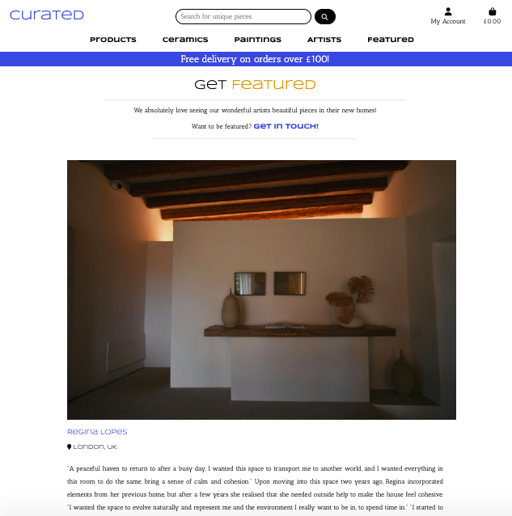

##### As a Site Admin I want to be able to add a feature/testimonial so that users can view them and are encouraged to use the platform and make purchases

- Under the My Account link in the navigation, the admin can click Feature Management to add a feature/testimonial to the site.

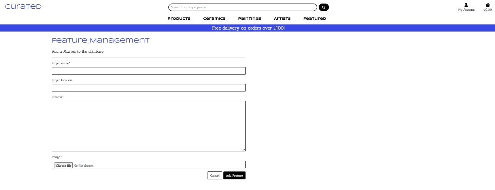

##### As a Site Admin I want to be able to edit a feature/testimonial so that any mistakes can be rectified or images changed

- When logged in, the admin can click edit to make changes to the feature/testimonial.

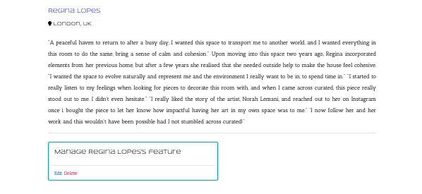

##### As a Site Admin I want to be able to delete a feature/testimonial in case it no longer fits the purpose for the site

- As above, the admin is able to delete a feature from the site.

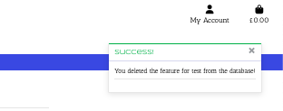

#### EPIC - Contact

##### As a Site User I want to be able to submit a contact form so that I can communicate with curated

- In the footer there is a link to a page where the user can 'Get in Touch' with curated.

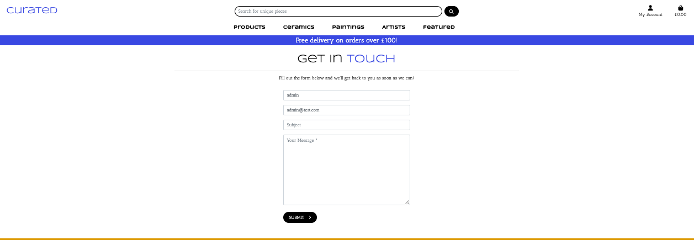

- Once submitted a confirmation page is displayed.

### Device and Browser Testing

The site was tested on the following devices:

- MacBook Air (main device)
- Lenovo c24-25 monitor
- iPhone 11

The site was tested on the following browsers:

- Google Chrome
- Microsoft Edge

### Responsiveness

Google Developer Tools was used throughout the development of this project especially when testing responsiveness. The site is responsive down to the smallest recommended screen size of 320px. I have also tested the site on my 17" MacBook Air as well as my monitor which is 24".

It was brought to my attention that the footer was not sticking to the bottom of some pages on larger screen sizes. I tried to troubleshoot this but couldn't really test it with the screens I had available. I am aware of this and will look to solve this in future.

## Code Validation

### W3C Markup HTML Validator

I copy and pasted the source code from each page into the W3C validator.

The only page that came up with errors was from the source code of the Add Product page. I couldn't find these errors in the HTML files at all. I also use an HTML validator extension which showed no errors on the same page. It seems to be part of the form, but this error isn't present on any of the other forms for adding a feature or artist.

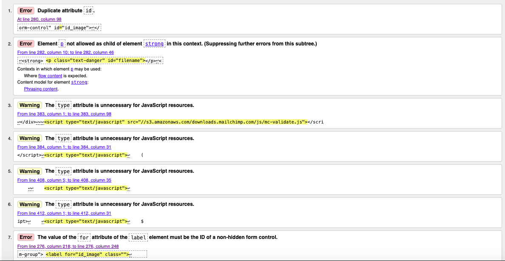

Apart from this there are no errors on any of the other pages, only warnings about using type='text' with JavaScript script tags.

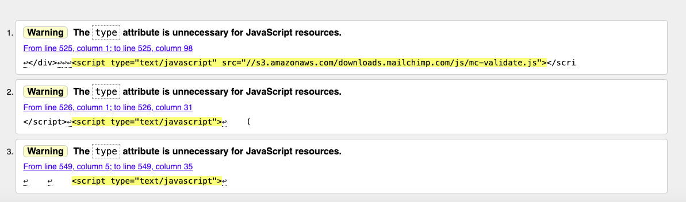

### Jigsaw Validator

CSS validator passed with no errors found.

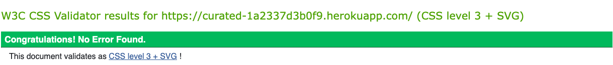

### JSHint JavaScript Validation

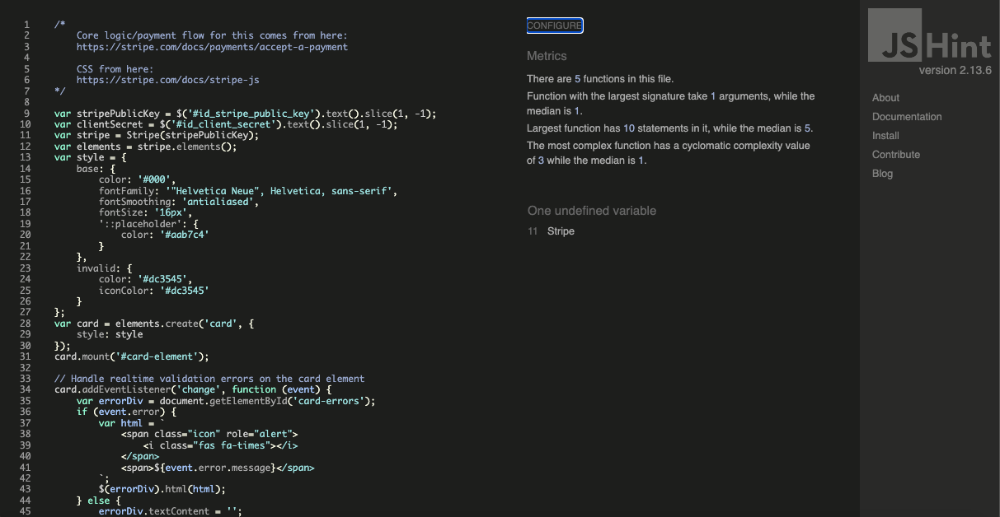

### Python Validation

## Lighthouse Testing

Results for Google Lighthouse testing can be found [here](./lighthouse.md).